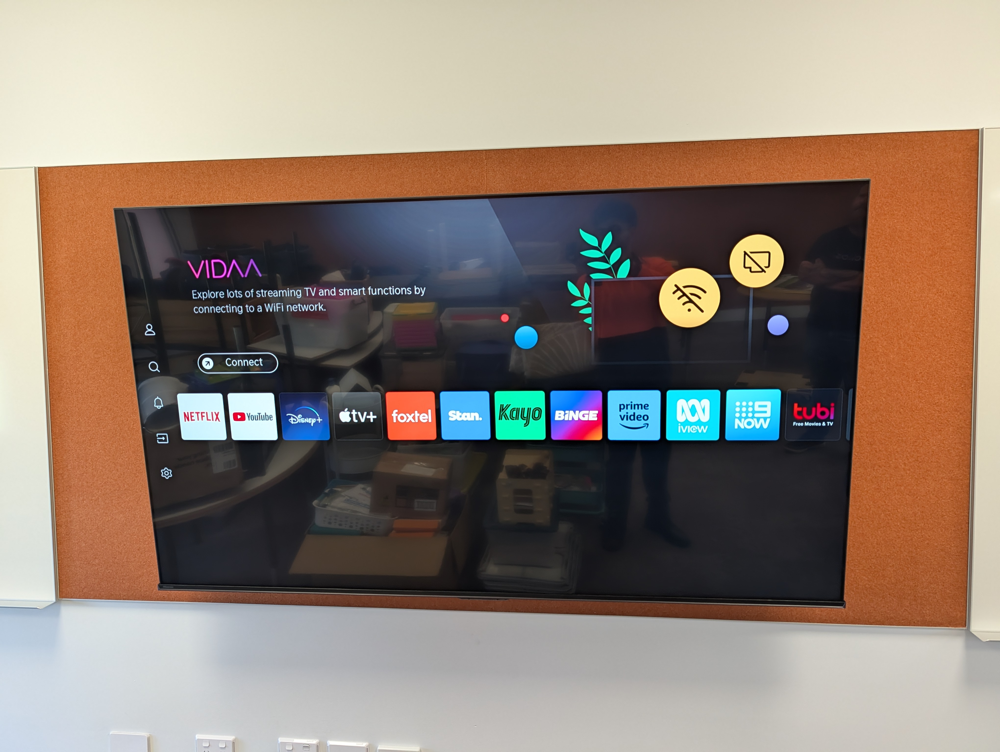
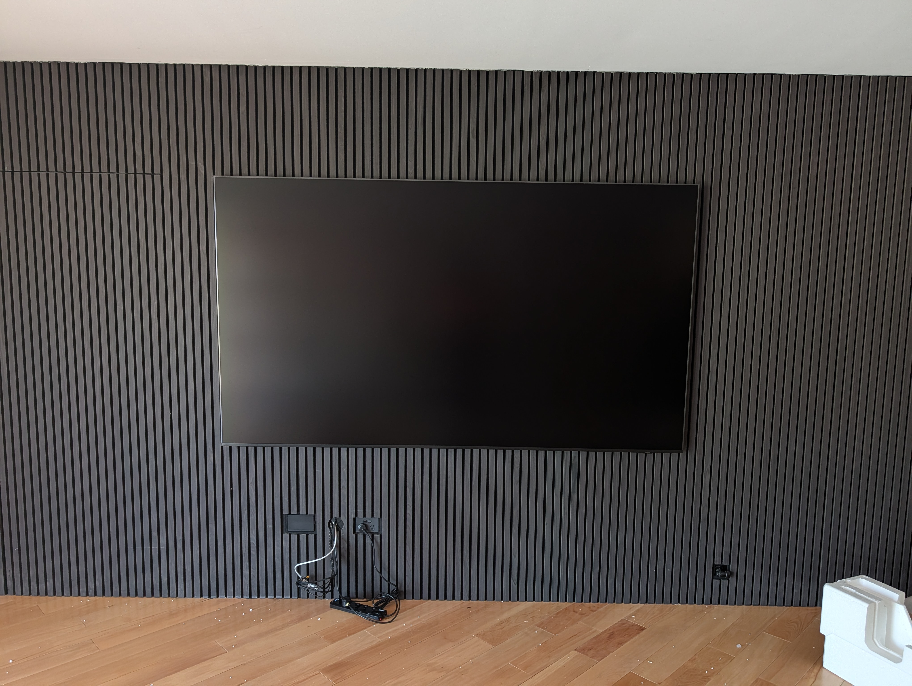

# AV Installation Case Studies (JB Hi-Fi Installs)

## Context
Delivered 2500+ residential and commercial AV installations with a focus on safe mounting, quality workmanship, and client handover.

## What this demonstrates
- Practical problem solving on real sites
- Safety awareness and risk control
- Diagnosing issues with unknown constraints
- Clear client communication and professional handover

# AV Installation Case Studies – JB Hi-Fi Installs

This section presents selected AV installation case studies demonstrating practical engineering judgement, safety awareness, and structured problem solving in real-world environments.

---

## Case Study 1 – Multi-Room Interactive Display Installation in an Educational Facility

### Context
A school required the installation of seven 75-inch displays across multiple classrooms in a newly constructed building prior to the start of term. The scope included five interactive displays and two standard displays, with the original requirement that all units be wall mounted.

The installation was carried out on an active school site with multiple stakeholders present, including school staff, other trades, and JB Hi-Fi Installs state management oversight.

---

### System overview
- Display size: 75-inch (all units)  
- Display types: 5 interactive displays, 2 standard displays  
- Intended mounting method: Wall mounted  
- Installation environment: Classrooms accessible to children  

---

### Constraints and risks
- Wall construction consisted of Gyprock/plasterboard over metal stud framing, with a pinboard layer installed over the wall surface  
- Displays were required to be centred within the pinboard area for aesthetic and practical reasons  
- Only a single metal stud was available within the mounting zone  
- Remaining fixings would rely on hollow wall anchors  
- Interactive displays are significantly heavier than standard displays  
- Children would be directly near or beneath the displays during normal use  

Given these conditions, the consequence of a mounting failure was assessed as unacceptably high.

---

### Engineering assessment
Site inspection confirmed that a single metal stud alone was insufficient to safely support the load of an interactive display. While hollow wall anchors may be acceptable for lighter standard displays, they do not provide adequate load capacity or redundancy for interactive displays in this application.

School staff advised that the walls had been reinforced during construction; however, no documentation or verification from the builder or architect was available to confirm this. Without verified structural reinforcement, proceeding with wall mounting would require assumptions about unseen support, which was not acceptable given the environment and risk profile.

*Mounting bracket positioned within pinboard constraints. Only a single metal stud was available within the mounting zone, with remaining fixings relying on hollow wall anchors — insufficient for interactive display loads without verified reinforcement.*

---

### Decision and actions
Given the presence of children and the inability to verify structural reinforcement, the residual risk of wall mounting the interactive displays was assessed as unacceptable.

To ensure continuity of learning and timely delivery:
- I identified that the school already utilised trolley-mounted interactive displays in older buildings  
- Confirmed that six spare trolleys were available on site  
- Proposed a revised installation approach using trolleys for the interactive displays  
- Coordinated with school staff, JB Hi-Fi Installs management, and offsiders to implement the revised plan  
- Proceeded with wall mounting the two standard displays where load and wall conditions were assessed as acceptable  

*Interactive display deployed on a mobile trolley as a risk-controlled alternative following assessment of wall structure and load capacity. This ensured operational readiness without compromising safety.*

---

### Outcome
- All seven displays were installed and operational prior to the start of the school term  
- Interactive displays were safely deployed on trolleys pending structural verification  
- Classroom functionality was maintained without delays to learning  
- The approach was supported on site by JB Hi-Fi Installs state management  
- School staff were satisfied with the outcome and system readiness  

*Standard display successfully wall mounted where load and wall conditions were assessed as acceptable. This installation contrasts with the heavier interactive displays, which required a different risk approach.*

---

### Reflection
This installation reinforced several key professional principles:
- Safety must take precedence over convenience, particularly in environments involving children  
- Verbal assurances are insufficient for structural decisions; verification is essential  
- Temporary engineering controls can be an effective solution when permanent solutions cannot be safely implemented  
- Clear communication and calm decision-making are critical when coordinating multiple stakeholders on active sites  

This experience strengthened my confidence in making and defending safety-critical decisions under real-world constraints.

---

## Case Study 2 – Large-Format (100-Inch) Display Installation on Feature Wall

### Context
Installation of a 100-inch television on a residential feature wall incorporating vertical cladding. The client required a centred, flush finish with all cabling concealed through the wall and cladding for a clean architectural outcome.

Due to the size and mass of the display, the installation required coordinated handling by multiple technicians.

---

### System overview
- Display size: 100-inch  
- Mount type: Heavy-duty fixed wall mount  
- Wall construction: Stud wall with decorative cladding  
- Cable management: In-wall and behind-cladding concealment  

---

### Constraints and risks
- Large display size requiring controlled manual handling  
- Feature wall finish requiring high positional accuracy  
- Limited tolerance for error due to cladding alignment  
- Risk of wall or display damage during lifting and mounting  
- Requirement to route power and signal cables without visible outlets  

---

### Engineering assessment
Prior to installation, the wall structure and stud locations were identified to ensure adequate load support. The mounting height and horizontal alignment were planned to maintain symmetry with the feature wall cladding.

Given the size of the display, a multi-person lift was assessed as necessary to:
- Maintain control of the load during positioning  
- Avoid point loading on the mount or wall during engagement  
- Reduce risk of injury or damage  

Cable routing paths were identified to allow concealment behind the cladding without compromising wall integrity or final appearance.

---

### Actions taken
- Coordinated a three-person lift with clear role allocation and communication  
- Installed and levelled the mounting bracket relative to cladding lines  
- Routed power and signal cabling through the wall cavity and behind the cladding  
- Carefully engaged the display onto the mount while maintaining alignment  
- Verified level, stability, and finish before final handover  

*Completed installation of a 100-inch display centred on a feature wall, with all cabling concealed for a clean architectural finish.*

---

### Outcome
- Secure installation with accurate alignment to the feature wall geometry  
- All cabling fully concealed with no visible surface wiring  
- Installation completed without damage to the wall finish or display  
- Client satisfied with both functionality and visual outcome  

---

### Reflection
This installation highlighted the importance of:
- Clear communication and role definition during multi-person handling tasks  
- Planning alignment and tolerances when working with architectural finishes  
- Sequencing tasks correctly to avoid rework or surface damage  
- Treating large-format installations as controlled engineering operations rather than routine installs  

The job reinforced how preparation and teamwork directly influence both safety and quality outcomes.

